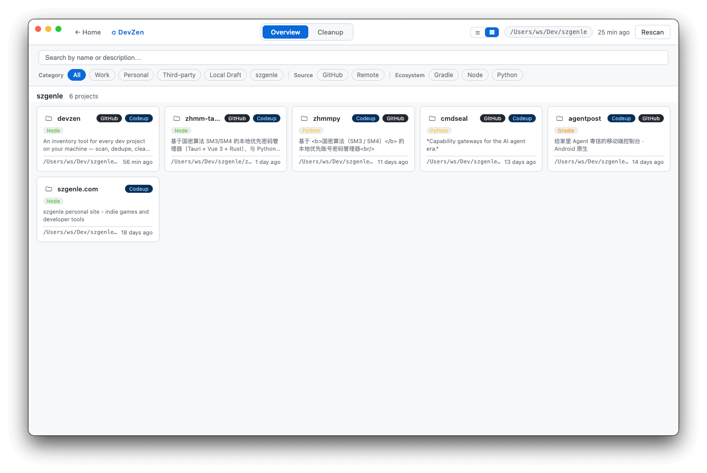
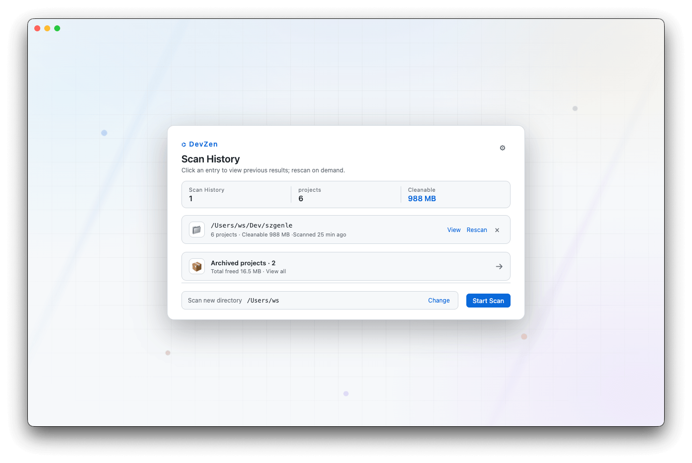
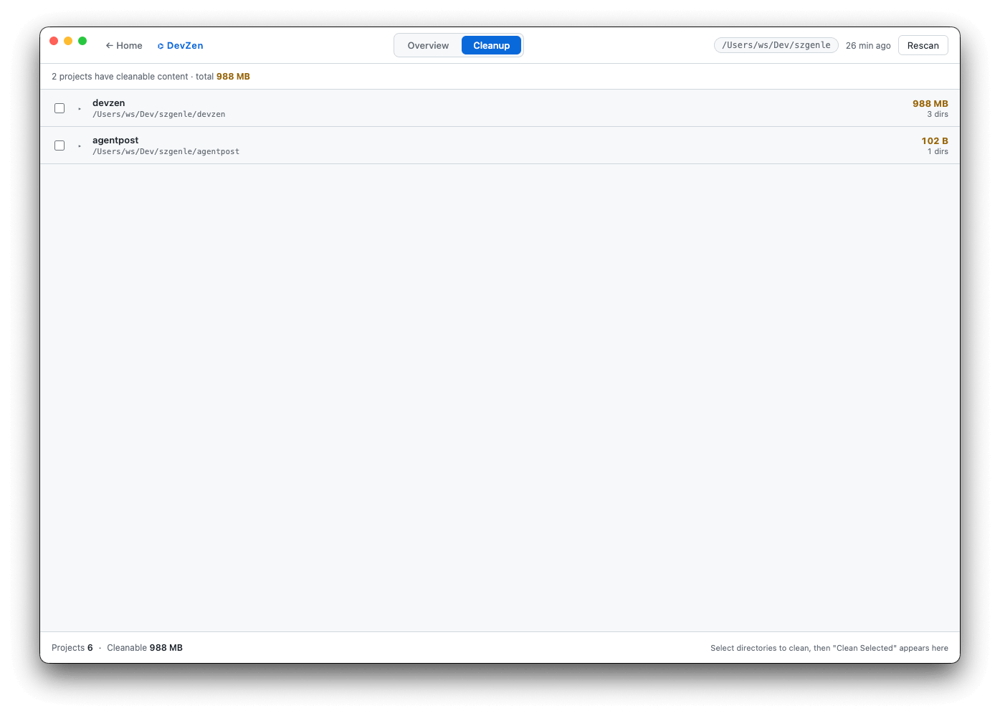
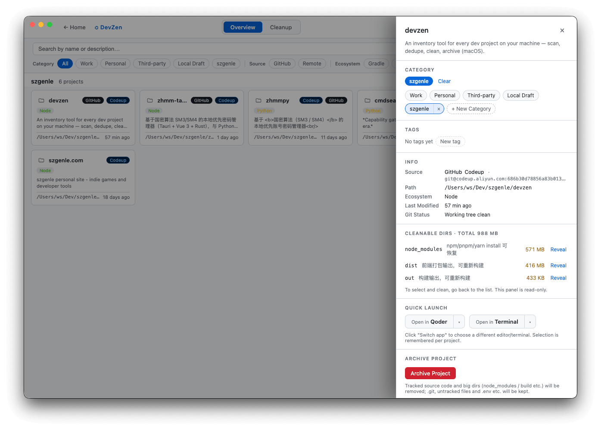
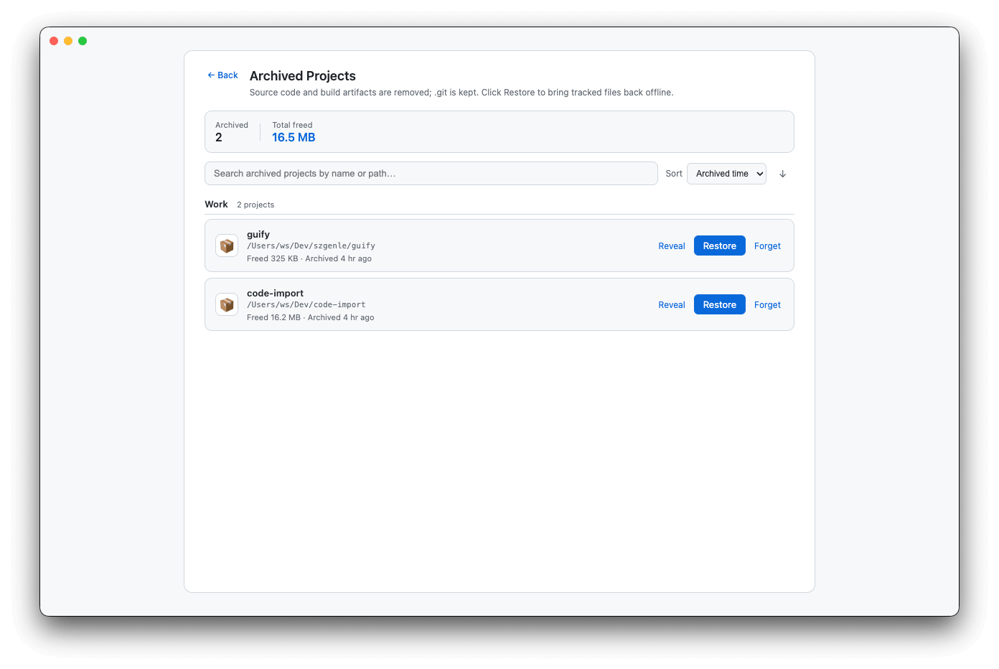

# DevZen

[简体中文](./README.md) | **English**

> An inventory of every dev project on your machine — scan, dedupe, clean, archive.

[](./LICENSE)
[](#-platform-support)
[](https://www.electronjs.org/)

See first, then act. DevZen isn't just another "cleanup tool" — it's an inventory of your local projects: what you have, where they came from, how much disk they take, and which ones are safe to delete.



## 🖥 Platform Support

v0.1.x is **macOS only**. Roughly 80% of the code (scan / clean / archive / dedupe / reveal) is already cross-platform — the only macOS-specific part is the editor/terminal launcher (built on LaunchServices `open -a`).

- ✅ macOS: stable
- 🛣 **Windows: planned for v0.2.0** (port the launcher, expand system-folder exclusion rules)
- 🤔 Linux: depends on community demand — feel free to open an issue with your use case

If you have a concrete Windows use case, drop a note in [Issues](https://github.com/szgenle/devzen/issues) — it directly shapes the v0.2.0 priority list.

## ✨ Current MVP

- **Scans your home directory by default** (e.g. `~`), intelligently skipping system folders (Library / Applications / Downloads …)
- Detects project types via ecosystem marker files (Node / Rust / Go / Python / Java / Xcode / SwiftPM)
- **Project info at a glance**: name / one-line description (from `package.json` description or README) / tech stack / **source** (GitHub / remote / local-only) / cleanable size / last modified / **uncommitted git changes**
- Check + confirm to clean build artifacts in one click — restricted to your home directory, target-folder whitelist, no symlink following
- **Strong warning for local-only projects**: explicitly tells you "these have no remote backup" before deletion
- Auto-rescan after cleanup; status bar shows space reclaimed

## 👥 Target Users

Any developer drowning in "too many messy projects" — especially people without a CS background who started coding via AI editors and only recently met GitHub. They may not know `node_modules` is disposable, may not remember which repos they cloned, and may have AI-generated projects that haven't been pushed yet. DevZen is also the author's own daily-use tool — "too many messy projects" is a pain point he has too.

## 📸 Screenshots

> Screenshots are from the English UI; switch language in the in-app Settings panel ([中文截图](./README.md#-界面截图)).

| Home | Overview |
|---|---|
|  |  |

| Cleanup | Project Detail |
|---|---|
|  |  |

| Archives |
|---|
|  |

## 🧱 Tech Stack

- Electron + electron-vite
- React 18 + TypeScript
- Main process uses Node.js built-ins only for scanning and cleanup

## 📦 Install

Download the latest `.dmg` from [Releases](https://github.com/szgenle/devzen/releases) and drag it into Applications.

> ⚠️ **First-launch note**: The build is **ad-hoc signed** (not Apple-notarized) — this is common for small open-source projects. Gatekeeper will block the first launch. Use either:
>
> - **Option 1**: In Finder → Applications, **right-click DevZen → Open → Open** (only the first time)
> - **Option 2**: Strip the quarantine attribute via Terminal:
>   ```bash
>   xattr -cr /Applications/DevZen.app
>   ```
>
> If you'd rather avoid this step, build from source (see the "Development" section below).

## 🚀 Development

```bash
# Install dependencies (first run downloads the Electron binary, may be slow)
npm install

# Dev server (opens the DevZen window)
npm run dev

# Typecheck
npm run typecheck

# Build & package for macOS (artifacts in dist/)
npm run dist:mac
```

## 📐 Project Layout

```
src/
├── main/              # Electron main process
│   ├── index.ts       # App entry, BrowserWindow
│   ├── ipc/           # IPC handlers
│   └── core/
│       ├── markers.ts # Ecosystem markers, cleanable dirs, system dir blacklist
│       ├── scanner.ts # Scan + detect + description + git status
│       └── cleaner.ts # Physical deletion + safety checks
├── preload/           # contextBridge → window.devzen
├── renderer/          # React renderer
│   └── src/
│       ├── App.tsx
│       ├── components/
│       └── utils/
└── shared/            # Types & IPC channel names shared between main / renderer
```

## 🛣 Roadmap

- [x] **MVP**: project discovery + build artifact cleanup + source classification
- [x] Safe GitHub project removal: delete local copy, keep remote info, one-click re-clone
- [x] Project categories & tags: personal / work / open-source clone
- [x] Duplicate detection: find multiple copies of the same repo, side-by-side compare
- [x] Quick launch: open project in your editor / terminal in one click
- [x] Cold-backup bundles for archived projects: pack into `.tar.gz` under a user-chosen backup dir with sha256 verification; restore back to original path or a new location
- [ ] **v0.2.0: Windows support** (port the launcher, expand system-folder exclusion, add `windows-latest` to CI matrix)

## 🔒 Safety Policy

- Only deletes standard, reproducible build-artifact folders (whitelist)
- Operations are restricted to paths inside the user's home directory
- Every deletion requires a renderer-side confirm dialog
- **Extra warning for local-only projects** — non-technical users won't mistake them as recoverable
- No symlink following — prevents escaping the home directory

## License

MIT © szgenle

See [LICENSE](./LICENSE).

## 🤝 Contributing

Bug reports and PRs are welcome. See [CONTRIBUTING.md](./CONTRIBUTING.md) for guidelines and [CHANGELOG.md](./CHANGELOG.md) for release history.
