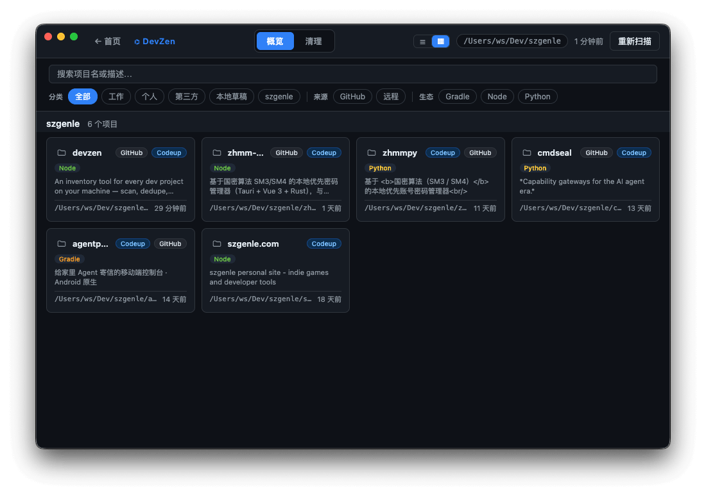
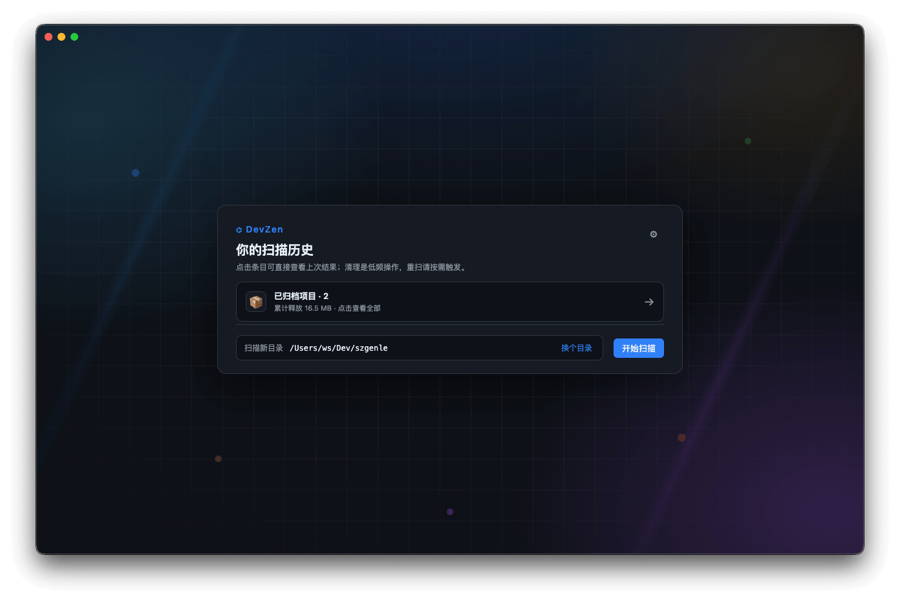
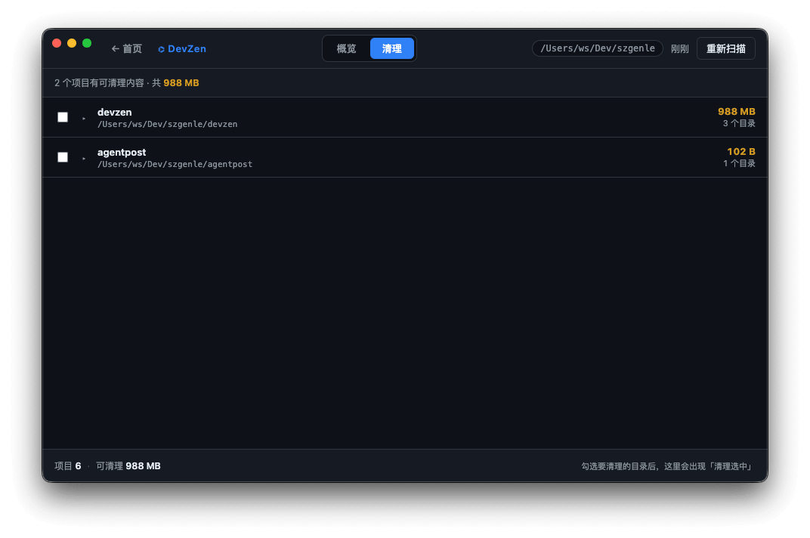
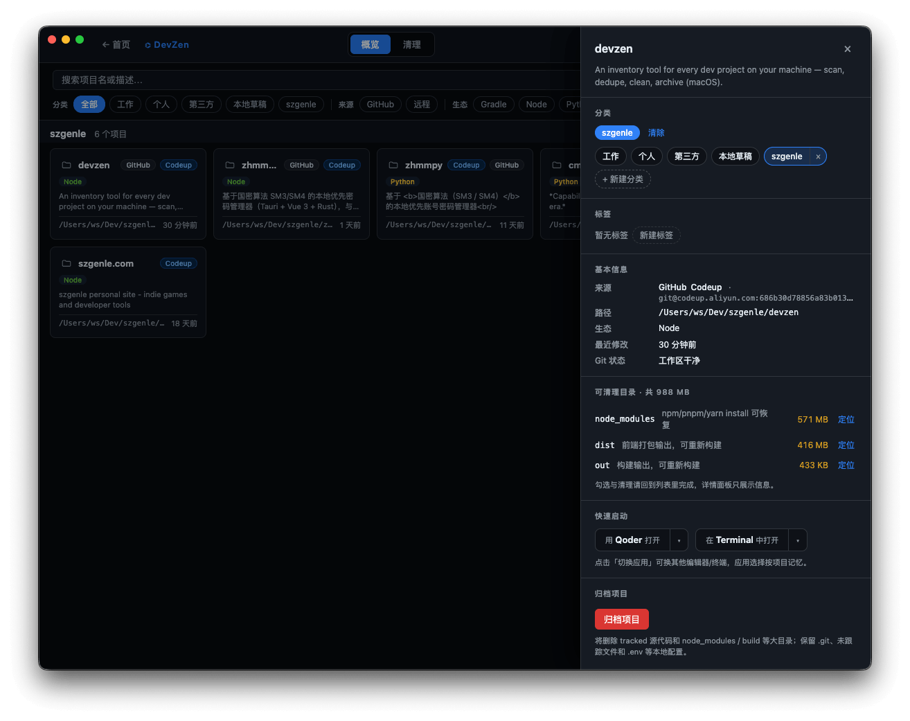
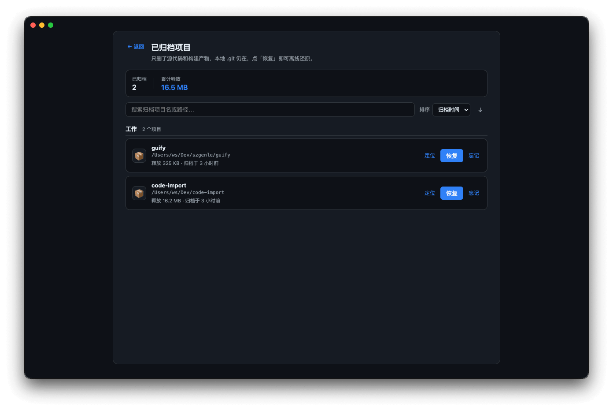

# DevZen

**简体中文** | [English](./README.en.md)

> 你本地所有项目的清单：扫描、去重、清理、归档。

[](./LICENSE)
[](#-平台支持)
[](https://www.electronjs.org/)

先看见，再行动。DevZen 不是另一个"清理工具"，而是你本地项目的清单：哪些项目、来自哪里、占了多少空间、哪些可以安全删除。



## 🖥 平台支持

当前 v0.1.x 仅支持 **macOS**。约 80% 的代码（扫描 / 清理 / 归档 / 重复检测 / Reveal）已经跨平台，真正与 macOS 强绑定的只有"编辑器/终端启动"逻辑（用了 LaunchServices `open -a`）。

- ✅ macOS：稳定
- 🛣 **Windows：已列入 v0.2.0 路线图**（适配启动逻辑、补充系统目录排除规则）
- 🤔 Linux：视社区需求评估，欢迎 Issue 反馈使用场景

如果你在 Windows 上有具体使用场景，请到 [Issues](https://github.com/szgenle/devzen/issues) 留言，会直接影响 v0.2.0 优先级排期。

## ✨ 当前 MVP

- **默认扫描主目录**（例如 `~`），并智能跳过系统目录（Library / Applications / Downloads …）
- 通过 ecosystem marker file 识别项目类型（Node / Rust / Go / Python / Java / Xcode / SwiftPM）
- **项目信息一目了然**：名称 / 一句话描述（读 package.json description 或 README） / 技术栈 / **来源**（GitHub / 远程 / 仅本地） / 可清理大小 / 上次修改时间 / **Git 是否有未提交修改**
- 勾选 + 二次确认即可一键清理构建产物，仅限定在用户家目录、目录名白名单、不跟随符号链接
- **对“仅本地”项目强提醒**：删除构建产物前会明确告诉你“这些项目没有远程备份”
- 清理后自动重扫，状态栏显示本次释放空间

## 👥 目标用户

所有受困于"项目多且乱"的开发者——尤其是非计算机科班出身、通过 AI 编程开始写代码和接触 GitHub 的新手：他们不一定知道 `node_modules` 能删、不一定记得自己 clone 过哪些项目、也可能用 AI 生成了项目但还没推到 GitHub。DevZen 也是作者自用的工具——"项目多且乱"这个痛点他自己也同样需要解决。

## 📸 界面截图

> 截图为简体中文界面，应用内可在「设置」中切换到 English（[English screenshots](./README.en.md#-screenshots)）。

| 首页 | 概览列表 |
|---|---|
|  |  |

| 清理列表 | 项目详情 |
|---|---|
|  |  |

| 归档列表 |
|---|
|  |

## 🧱 技术栈

- Electron + electron-vite
- React 18 + TypeScript
- 主进程仅依赖 Node.js 内置模块进行扫描与清理

## 📦 安装

到 [Releases](https://github.com/szgenle/devzen/releases) 页面下载最新的 `.dmg`，双击安装即可。

> ⚠️ **首次打开提示**：当前版本采用 ad-hoc 签名（未走 Apple 公证），属于开源项目常见做法。首次打开会被 Gatekeeper 拦截，按以下任一方式处理：
>
> - **方式一**：在「应用程序」中找到 DevZen，**右键 → 打开 → 仍要打开**（仅首次需要）
> - **方式二**：终端执行一条命令清除隔离属性
>   ```bash
>   xattr -cr /Applications/DevZen.app
>   ```
>
> 如果你介意这个步骤，也可以走源码自构建（见下方「开发」段）。

## 🚀 开发

```bash
# 安装依赖（首次需联网下载 Electron 二进制，可能较慢）
npm install

# 启动开发服务（自动打开 DevZen 窗口）
npm run dev

# 类型检查
npm run typecheck

# 打包 macOS（产物在 dist/ 目录）
npm run dist:mac
```

## 📐 目录结构

```
src/
├── main/              # Electron 主进程
│   ├── index.ts       # 应用入口、BrowserWindow
│   ├── ipc/           # IPC 路由
│   └── core/
│       ├── markers.ts # 生态 marker / 可清理目录 / 系统目录黑名单
│       ├── scanner.ts # 扫描 + 识别 + 描述提取 + git 状态检测
│       └── cleaner.ts # 物理删除 + 安全校验
├── preload/           # contextBridge 暴露 window.devzen
├── renderer/          # React 渲染层
│   └── src/
│       ├── App.tsx
│       ├── components/
│       └── utils/
└── shared/            # 主/渲染共享类型与 IPC 通道名
```

## 🛣 路线图

- [x] **MVP**：项目发现 + 构建产物清理 + 来源区分
- [x] GitHub 项目安全卸载：删本地保远程，随时一键 clone 回来
- [x] 项目分类与标签：个人 / 公司 / 开源 clone
- [x] 重复项目检测：识别同一仓库的多份副本，对比辅助决策
- [x] 快速启动入口：一键用编辑器/终端打开项目
- [x] 已归档项目冷备包：压缩为 `.tar.gz` 存到自选备份目录，sha256 校验，可恢复回原路径或新位置
- [ ] **v0.2.0：Windows 支持**（编辑器/终端启动适配、系统目录排除规则补充、CI 加 windows-latest 矩阵）

## 🔒 安全策略

- 只删除标准的、可重建的构建产物目录（白名单）
- 仅允许操作用户家目录内的路径
- 所有删除操作必须经渲染层弹窗二次确认
- **仅本地项目额外强提醒**，避免不懂技术的用户误以为可恢复
- 不跟随符号链接，避免穿透到家目录之外

## License

MIT © szgenle

详见 [LICENSE](./LICENSE)。

## 🤝 贡献

欢迎通过 Issue 反馈问题或提交 PR，贡献规范见 [CONTRIBUTING.md](./CONTRIBUTING.md)，版本变更记录见 [CHANGELOG.md](./CHANGELOG.md)。
